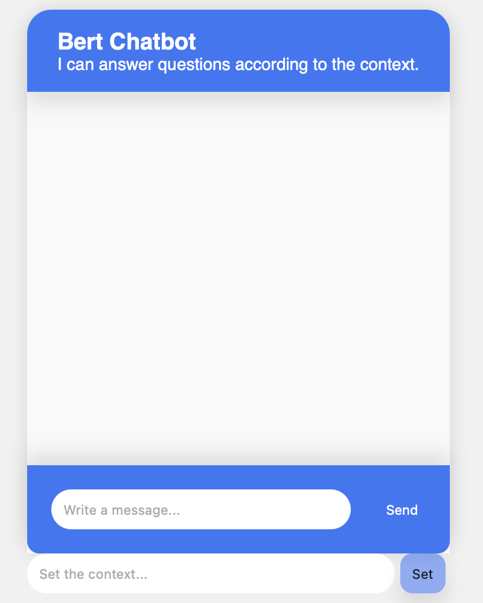
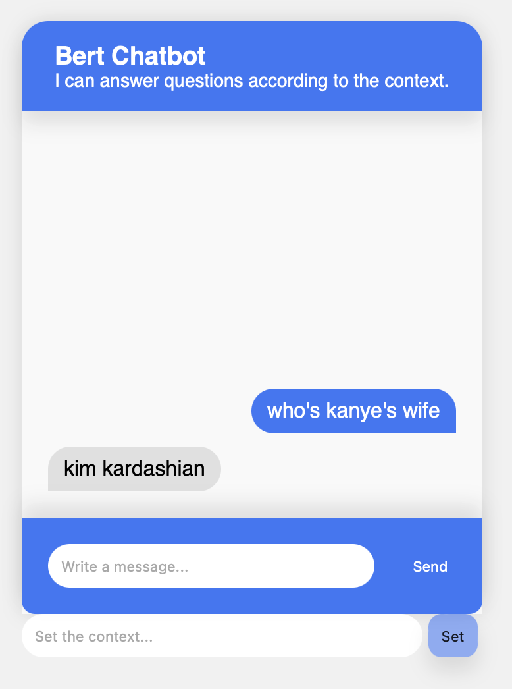
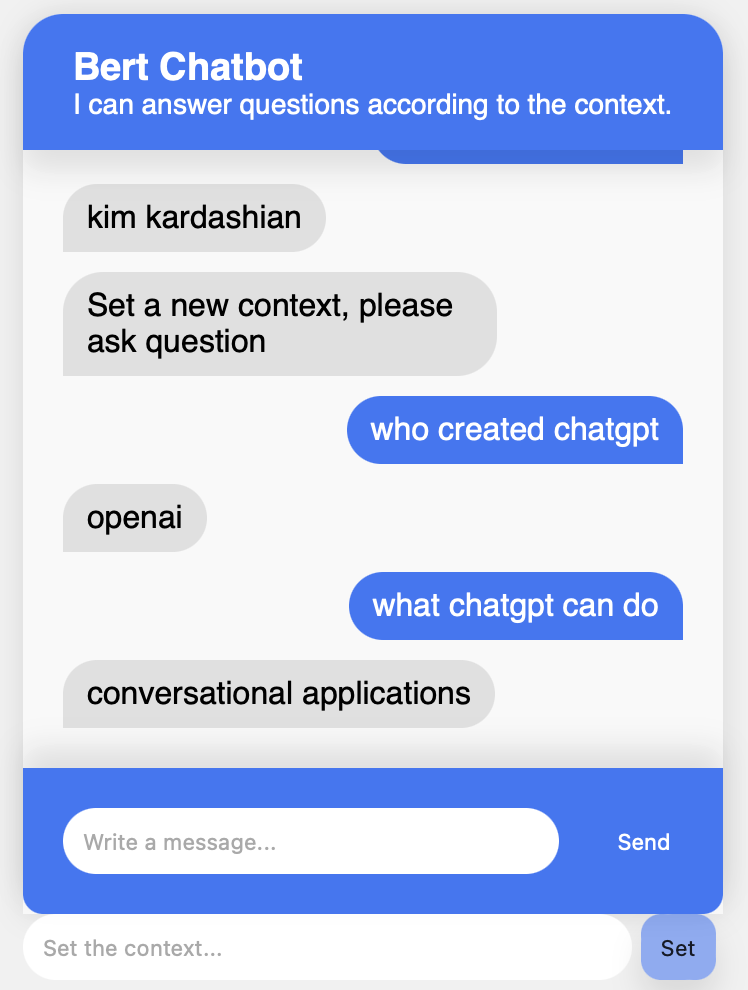

# Bert QA Chatbot
## Get the repository
git clone git@github.com:CeiHau/chatbot.git

## Intallation and running
### Install pacakges
```
!pip install transformers
!pip install torch
!pip install flask
````
## Load model and tokenizer
The model and tokenizer are saved in resources
```angular2html
from transformers import BertForQuestionAnswering
model = BertForQuestionAnswering.from_pretrained('resource/', local_files_only = True)

from transformers import BertTokenizer
tokenizer = BertTokenizer.from_pretrained('resource/', local_files_only = True)
```
## Run
```angular2html
python app.py 
```
or
```angular2html
flask --app app run
```
## Guide
### Interface
The following is the interface of Chatbot


### Usage
#### Ask Question
Because of the characteristic of bert, it's good at QA task. So we need to prove the context for the Chatbot.

The default context is:
**Kanye West initially made his mark on the music industry as a producer for leading artists. He showcased his own abilities as a rapper with his 2004 debut, College Dropout, and cemented his place atop the hip hop world via such chart-topping albums as Late Registration (2005), My Beautiful Dark Twisted Fantasy (2010), Yeezus (2013) and Ye (2018). The winner of nearly two dozen Grammy Awards, West is also known for his awards-show theatrics, forays into fashion and marriage to Kim Kardashian.**

So we can ask the following question and Chatbot will provide the answer according to the context we provided.


#### Update Context
We can also set new context. For example, we set the context to:
```angular2html
ChatGPT[a] is an artificial intelligence (AI) chatbot developed by OpenAI and released in November 2022. It is built on top of OpenAI's GPT-3.5 and GPT-4 foundational GPT large language models (LLMs), and has been fine-tuned (an approach to transfer learning) for conversational applications using both supervised and reinforcement learning techniques.
```

Then we can ask question about new topic(context)



# Reference
[BERT NLP — How To Build a Question Answering Bot](https://towardsdatascience.com/bert-nlp-how-to-build-a-question-answering-bot-98b1d1594d7b) <br/>
[【機器學習2021】Transforme Hung-yi Lee ](https://www.youtube.com/watch?v=n9TlOhRjYoc) <br/>
[Building a ChatGPT-like Platform with BERT: A Beginner’s Guide](https://promactinfo.com/blogs/building-a-chatgpt-like-platform-with-bert-a-beginners-guide/) <br/>
[PyTorch-Transformers- HuggingFace Team](https://colab.research.google.com/github/pytorch/pytorch.github.io/blob/master/assets/hub/huggingface_pytorch-transformers.ipynb) <br/>
[Transformers Notebooks](https://huggingface.co/transformers/v3.2.0/notebooks.html#community-notebooks) <br/>
[Text Classification with BERT in PyTorch](https://towardsdatascience.com/text-classification-with-bert-in-pytorch-887965e5820f#:~:text=BERT%20model%20expects%20a%20sequence,which%20stands%20for%20classification%20token.)
